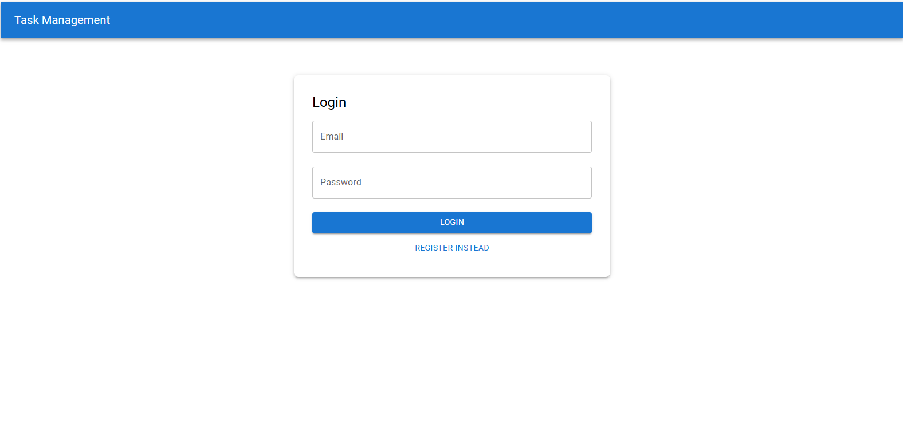
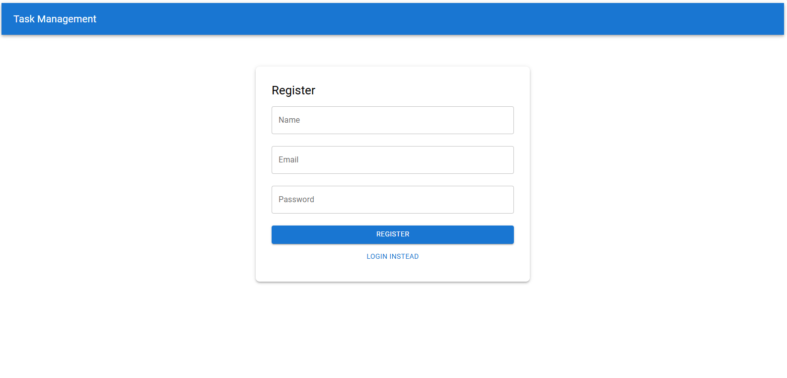
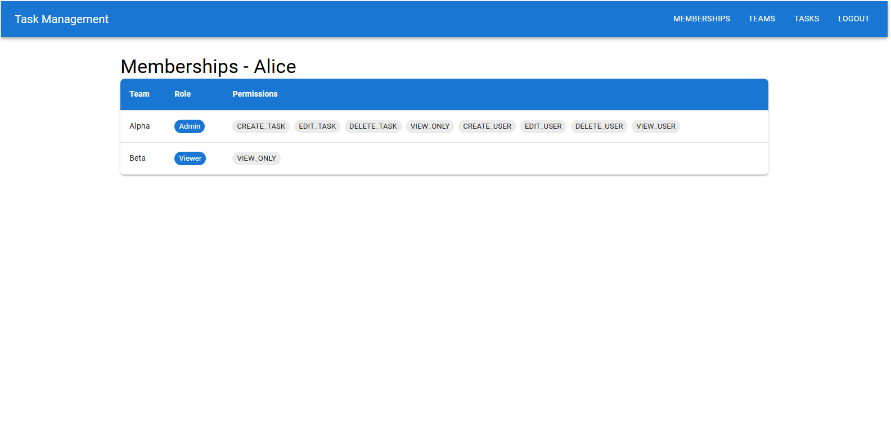
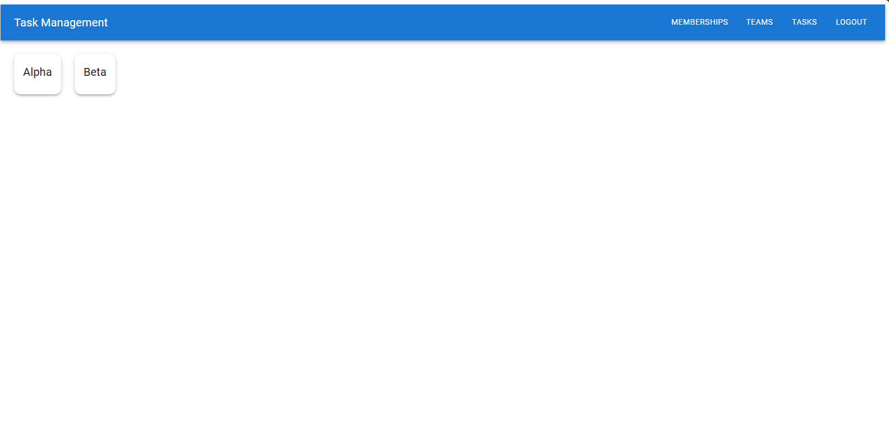
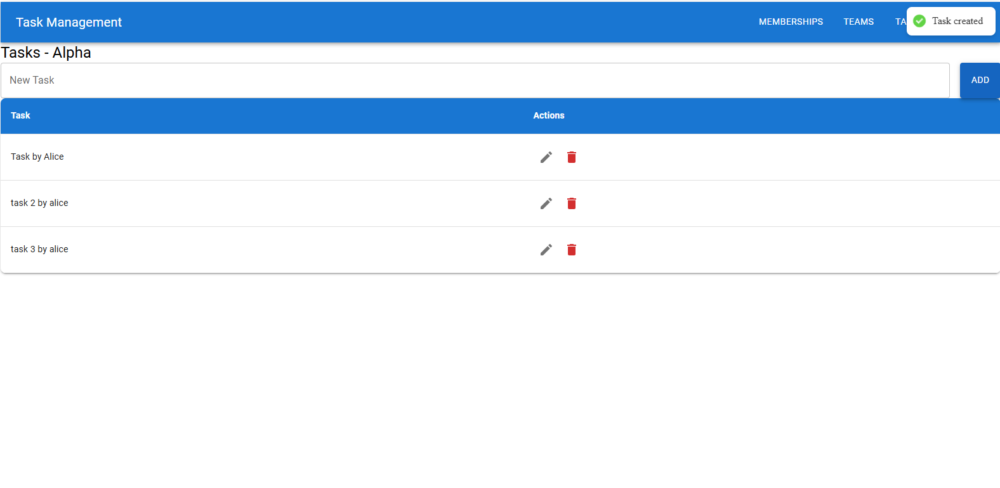
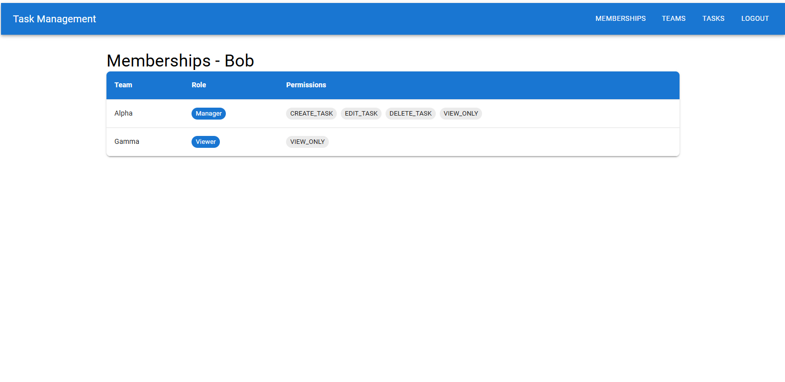
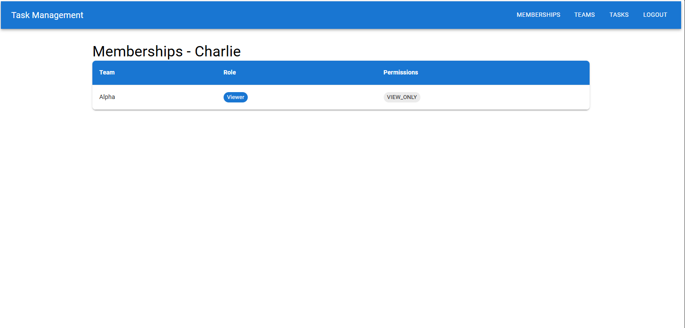
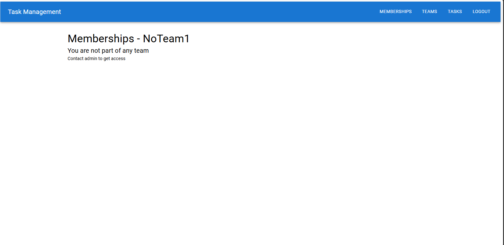

# MERN RBAC Team Management System

## Overview

A full-stack MERN application implementing Role-Based Access Control (RBAC) with team-specific permissions.

Users can belong to multiple teams and have different roles in each team.

---

## Core Concept
**User + Team → Role → Permissions**

---

## Tech Stack

### Backend
- Node.js
- Express
- MongoDB
- JWT + bcrypt

### Frontend
- React (Vite)
- Material UI
- Axios

---

## Project Structure

```
client/ → React frontend
server/ → Node.js backend
```

---

## Setup Instructions

### 1. Clone repository
```bash
git clone <repo_url>
```

---

### 2. Backend Setup
```bash
cd server
npm install
```

Create `.env`:
```
PORT=5000
MONGO_URI=your_mongodb_connection_string
JWT_SECRET=your_secret
```

Run:
```bash
npm run dev
```

---

### 3. Frontend Setup
```bash
cd client
npm install
npm run dev
```

---

## Seed Data
```bash
cd server
node seed.js
```

Default password:
```
123456
```

---

## Roles & Permissions

| Role    | Permissions |
|---------|------------|
| Admin   | Full access |
| Manager | CRUD Tasks |
| Viewer  | View only |

---

## Features
- JWT Authentication
- RBAC (Role-Based Access Control)
- Team-specific roles
- Membership-based permission resolution
- Task management with permission enforcement
- Dynamic frontend UI based on permissions

---

## Screenshots

<p align="center">
  <h3>Auth & Other pages</h1>
  
  
  
  
  
</p>

<p align="center">
  <h3>RBAC</h1>
  
  
  
  
</p>
---

## UI Highlights
- Material UI components
- Reusable table component
- Team cards
- Task DataGrid
- Toast notifications

---

## Design Decisions
- Roles scoped per team (Membership model)
- No hardcoded permissions
- Middleware-based authorization
- Reusable UI components

---

## Bonus Features
- Task module with RBAC
- Seed data for testing
- Clean architecture

---

## Future Improvements
- Deployment (Render + Netlify)
- Pagination
- Global admin role
- Notifications
